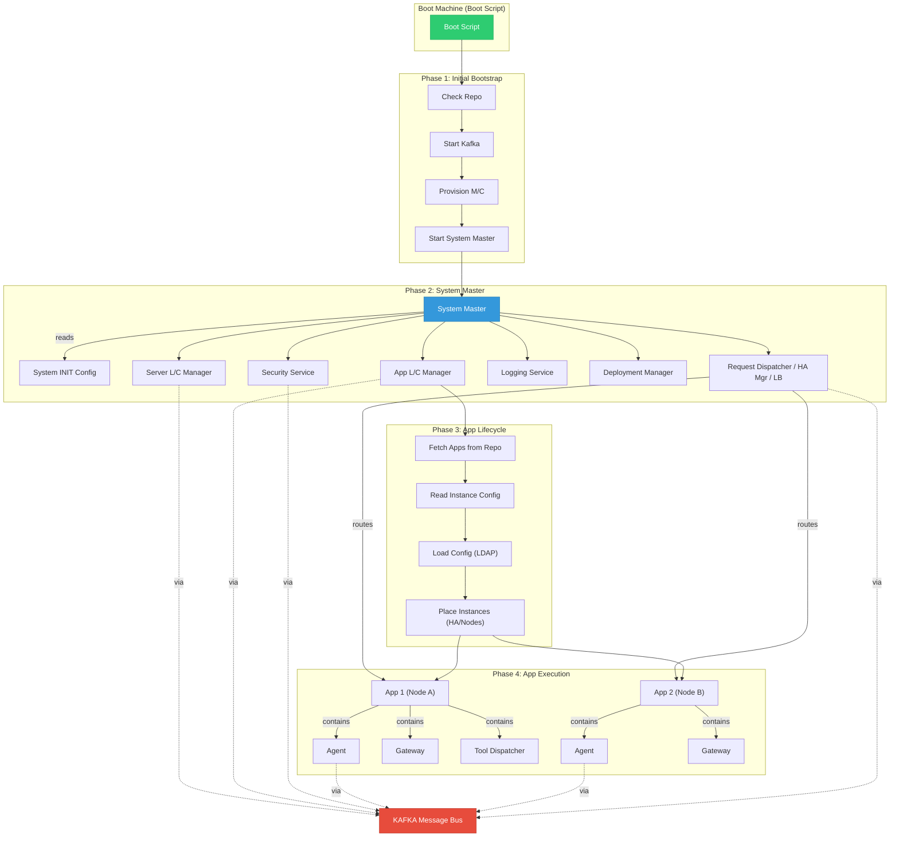
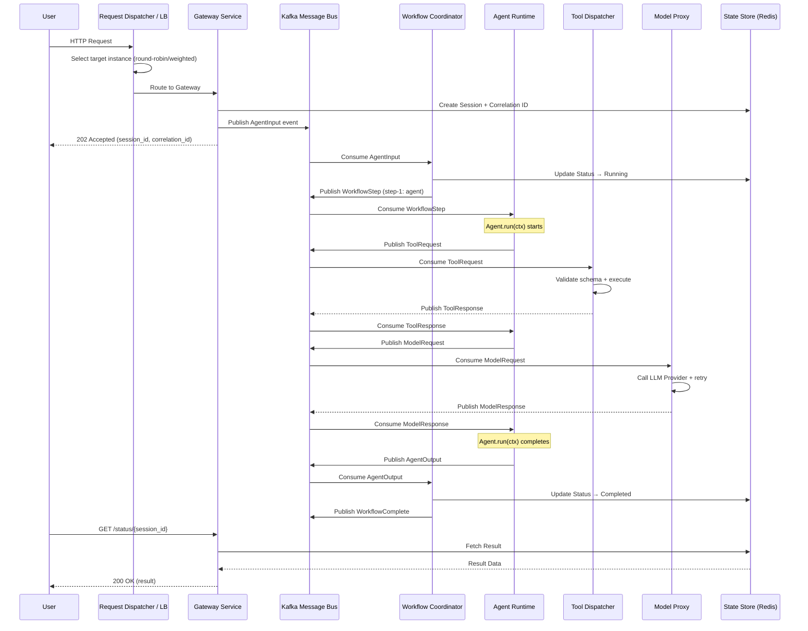

# 4a — Execution Flow & Demonstration

**Document:** Execution Flow Illustration + Demo Guide  
**Platform:** Sputniq AgentOS  
**Version:** 1.0.0

---

## 1. Platform Architecture Diagram



---

## 2. Request Execution Sequence

This diagram shows the complete flow when a user sends a request to a running application:



---

## 3. Sample App Execution — Step by Step

### 3.1 The Application

The sample app is a **Weather Agent** that:
1. Receives a location query from the user
2. Invokes the `get-weather` tool to fetch weather data
3. Uses a model (GPT-mock) to generate a natural-language response
4. Returns the response to the user

### 3.2 Execution Flow

```
User: "What's the weather in London?"
  │
  ├── 1. Request hits Request Dispatcher
  │       └── Load balancer selects instance "weather-agent-0"
  │
  ├── 2. Gateway creates session
  │       ├── session_id: "abc-123"
  │       └── correlation_id: "xyz-789"
  │
  ├── 3. Workflow Coordinator receives task
  │       └── Executes "weather-workflow" → step-1 (agent: weather-agent)
  │
  ├── 4. WeatherAgent.run(ctx) executes
  │       ├── ctx.input = "What's the weather in London?"
  │       │
  │       ├── 4a. ctx.tool("get-weather", location="London")
  │       │       └── Tool returns: {"location": "London", "forecast": "Sunny", "temperature_c": 28}
  │       │
  │       └── 4b. ctx.model("gpt-mock", messages=[...])
  │               └── Model returns: "It's a beautiful sunny day in London at 28°C!"
  │
  ├── 5. Workflow completes → result stored in State Store
  │
  └── 6. User polls → receives response
          "It's a beautiful sunny day in London at 28°C!"
```

---

## 4. Running the Demo

### 4.1 Prerequisites

- Docker + Docker Compose installed
- Python 3.11+
- 4 GB free disk space (for container images)

### 4.2 Quick Start (Docker Compose)

```bash
# 1. Clone the repository
cd sputniq

# 2. Build and start the entire stack
docker compose up --build -d

# 3. Verify all services are running
docker compose ps

# 4. Access the dashboard
# Open: http://localhost:8000/
```

### 4.3 Deploy the Sample App

```bash
# Package the sample app
python scripts/create_sample_app.py

# Deploy via cURL
curl -X POST -F "file=@sample_app.zip" http://localhost:8000/api/v1/registry/upload-zip

# Or use the dashboard: navigate to http://localhost:8000/ and upload the ZIP
```

### 4.4 Run the Bootstrap

```bash
# Via CLI (from the sample_app directory)
cd sample_app
agentos bootstrap --config config.json

# Via API
curl -X POST http://localhost:8000/api/v1/system/bootstrap \
  -H "Content-Type: application/json" \
  -d '{"app_repository": [{"name": "sample-agent-system"}]}'
```

### 4.5 Interact with the Agent

```bash
# Via the dashboard chatbox at http://localhost:8000/

# Or via cURL (trigger workflow)
curl -X POST http://localhost:8000/workflows/weather-workflow/trigger \
  -H "Content-Type: application/json" \
  -d '{"query": "What is the weather in London?"}'
```

### 4.6 Verify System State

```bash
# Check boot status
curl http://localhost:8000/api/v1/system/boot-status | python -m json.tool

# List system services
curl http://localhost:8000/api/v1/system/services | python -m json.tool

# List provisioned nodes
curl http://localhost:8000/api/v1/nodes | python -m json.tool

# Check health
curl http://localhost:8000/health | python -m json.tool

# List registered agents
curl http://localhost:8000/api/v1/registry/agents | python -m json.tool

# List deployments
curl http://localhost:8000/api/v1/registry/deployments | python -m json.tool
```

---

## 5. Demo Video Guide

To record a compelling demonstration video, follow these steps:

### 5.1 Setup (Before Recording)

1. Ensure Docker Compose stack is running (`docker compose up --build -d`)
2. Have a terminal and a browser window ready
3. Open `http://localhost:8000/` in the browser

### 5.2 Recording Sequence

| # | Duration | Screen          | Action                                           |
|---|----------|-----------------|--------------------------------------------------|
| 1 | 30s      | Terminal        | Show `docker compose ps` — all services running  |
| 2 | 15s      | Terminal        | Run `agentos bootstrap` — show 4-phase output    |
| 3 | 15s      | Terminal        | Run `agentos boot-status` — show service status  |
| 4 | 20s      | Browser         | Navigate to `http://localhost:8000/` dashboard    |
| 5 | 15s      | Browser         | Show registered workflows, agents, tools tabs    |
| 6 | 20s      | Terminal        | Package sample app: `python scripts/create_sample_app.py` |
| 7 | 20s      | Browser/Terminal| Upload ZIP via dashboard or cURL                 |
| 8 | 15s      | Browser         | Show deployment appears in deployments panel     |
| 9 | 30s      | Browser         | Use the chatbox — send "What is the weather in Mumbai?" |
| 10| 15s      | Browser         | Show the agent response in the chatbox           |
| 11| 20s      | Terminal        | Hit `curl /health` and `curl /api/v1/system/boot-status` |
| 12| 15s      | Terminal        | Show `docker logs sputniq-sample-agent-system-gateway` |
| 13| 10s      | Both            | Conclude — summarize architecture on screen       |

### 5.3 Key Points to Narrate

1. **Config-driven**: "Everything is declared in `config.json` — no infrastructure code"
2. **Boot sequence**: "The platform boots in 4 phases — System first, then Applications"
3. **System Master**: "The System Master reads the INIT config and starts 6 core services"
4. **Kafka backbone**: "All communication flows through the Kafka message bus"
5. **Load balancing**: "The Request Dispatcher routes traffic with HA failover"
6. **App lifecycle**: "Apps are fetched, configured, and placed automatically"

### 5.4 Recommended Recording Tools

- **OBS Studio** (Linux/Mac/Windows) — screen recording with audio
- **asciinema** — terminal-only recordings (great for CLI demos)
- **Loom** — quick browser-based recording

---

## 6. Architecture Mapping Summary

| Architecture Concept        | Sputniq Implementation                    | Code Location                         |
|-----------------------------|-------------------------------------------|---------------------------------------|
| Boot Script                 | `PlatformBootstrap.run()`                 | `runtime/bootstrap.py`               |
| System Master               | `SystemMaster`                            | `runtime/system_master.py`            |
| System INIT Config          | `SystemINITConfig` model                  | `models/platform.py`                 |
| Server L/C Manager          | `ServerLifecycleManager`                  | `runtime/lifecycle.py`               |
| App L/C Manager             | `AppLifecycleManager`                     | `runtime/lifecycle.py`               |
| Security Service            | JWT Auth + DependencyScanner              | `api/auth.py`, `ops/security.py`     |
| Logging Service             | Structured logging + OpenTelemetry        | `observability/tracing.py`           |
| Deployment Manager          | `DeploymentEngine` + `ImageBuilder`       | `ops/deployment.py`, `ops/builder.py`|
| Request Dispatcher / HA / LB| `RequestDispatcher`                       | `runtime/dispatcher.py`              |
| Kafka Message Bus           | `KafkaMessageProducer/Consumer`           | `bus/kafka.py`                       |
| App Model (Artefacts)       | `config.json` + source code               | `sample_app/`                        |
| Runtime Definition          | `RuntimeDefinition` model                 | `models/platform.py`                 |
| Repository Structure        | `RepositoryConfig` model                  | `models/platform.py`                 |
| Boot Cycles                 | `SystemBootPhase` + `AppBootPhase` enums  | `models/boot.py`                     |
