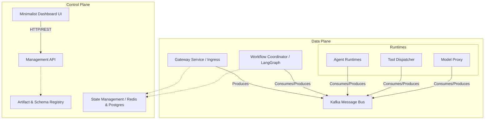
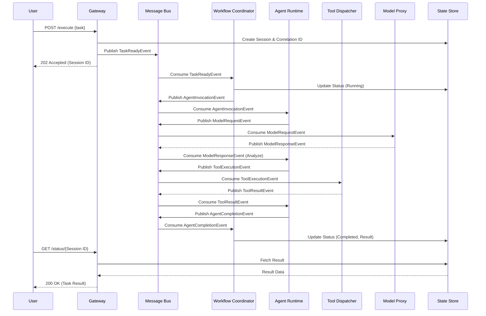

# Sputniq AgentOS Architecture & Sequence Diagrams

## Architectural Diagram

```mermaid
graph TD
    subgraph Control Plane
        API[Management API]
        UI[Minimalist Dashboard UI]
        Registry[Artifact & Schema Registry]
        State[State Management / Redis & Postgres]
    end

    subgraph Data Plane
        Gateway[Gateway Service / Ingress]
        Coordinator[Workflow Coordinator / LangGraph]
        
        subgraph Runtimes
            AgentRuntime[Agent Runtimes]
            ToolDispatcher[Tool Dispatcher]
            ModelProxy[Model Proxy]
        end
        
        Bus[Kafka Message Bus]
    end
    
    UI -->|HTTP/REST| API
    Gateway -->|Produces| Bus
    Coordinator -->|Consumes/Produces| Bus
    AgentRuntime -->|Consumes/Produces| Bus
    ToolDispatcher -->|Consumes/Produces| Bus
    ModelProxy -->|Consumes/Produces| Bus
    
    Gateway -.-> State
    Coordinator -.-> State
    API -.-> Registry
```

## Sequence Diagram (Request Execution)

```mermaid
sequenceDiagram
    participant User
    participant Gateway
    participant Bus as Message Bus
    participant Coordinator as Workflow Coordinator
    participant Agent as Agent Runtime
    participant Tool as Tool Dispatcher
    participant Model as Model Proxy
    participant State as State Store

    User->>Gateway: POST /execute {task}
    Gateway->>State: Create Session & Correlation ID
    Gateway->>Bus: Publish TaskReadyEvent
    Gateway-->>User: 202 Accepted (Session ID)
    
    Bus->>Coordinator: Consume TaskReadyEvent
    Coordinator->>State: Update Status (Running)
    Coordinator->>Bus: Publish AgentInvocationEvent
    
    Bus->>Agent: Consume AgentInvocationEvent
    Agent->>Bus: Publish ModelRequestEvent
    
    Bus->>Model: Consume ModelRequestEvent
    Model-->>Bus: Publish ModelResponseEvent
    
    Bus->>Agent: Consume ModelResponseEvent (Analyze)
    Agent->>Bus: Publish ToolExecutionEvent
    
    Bus->>Tool: Consume ToolExecutionEvent
    Tool-->>Bus: Publish ToolResultEvent
    
    Bus->>Agent: Consume ToolResultEvent
    Agent->>Bus: Publish AgentCompletionEvent
    
    Bus->>Coordinator: Consume AgentCompletionEvent
    Coordinator->>State: Update Status (Completed, Result)
    
    User->>Gateway: GET /status/{Session ID}
    Gateway->>State: Fetch Result
    State-->>Gateway: Result Data
    Gateway-->>User: 200 OK (Task Result)
```
