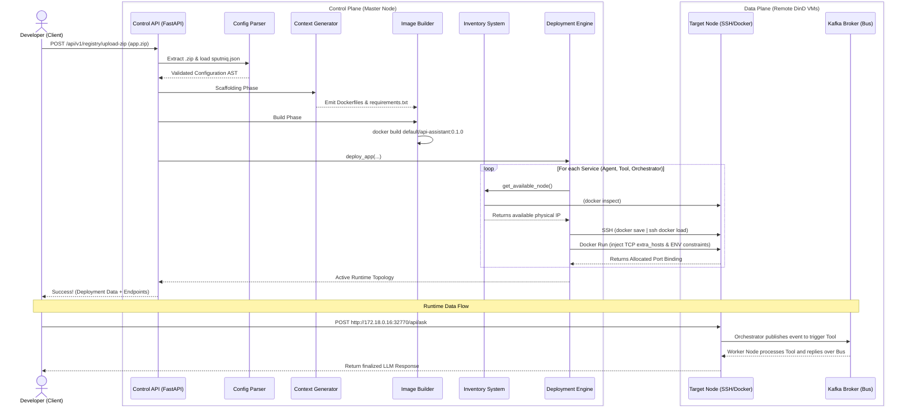

# Sputniq AgentOS Architecture & Flow

This document details the final data flow, component reality check, and future work for the Sputniq Platform built on Python, LangGraph, Kafka, and Docker.

## End-to-End System Flow

When a user submits an application (`sputniq.json` bundled in a `.zip`) to the platform, the following sequence triggers:

### The Step-By-Step Breakdown:
1. **Upload & Parse**: The developer blasts a `zip` to the core FastAPI server. Sputniq unzips it inside a temporary directory, parses the schema config using Pydantic, checks for circular dependencies, and links workflow references.
2. **Context Generation (`engine.py`)**: Sputniq copies the user's logic (`run.py`, `agents/assistant.py`) into isolated `/.agentos/build` directories and injects the Sputniq Core Python SDK, bridging the user code with platform dependencies. Standardized Dockerfiles are generated.
3. **Internal Build (`builder.py`)**: The system asks the local `Docker daemon` to build these containers safely and tagging them cleanly according to namespaces and version.
4. **Inventory Discovery (`inventory.py`)**: The deployer asks the inventory system for a target VM. The inventory executes subnet inspection to grab a real `172.18.x.x` physical IP from the active cluster (simulated VMs).
5. **Distribution (`deploy.py`)**: Sputniq pipes the local built Docker Image into STDOUT, passes it over an `SSH` socket into the target VM directly, and requests it load the image. It then triggers `docker run` over `ssh://`, injecting `extra_hosts` so the target isolates itself yet knows how to TCP back to the central `Kafka:9092` broker.

---

## The Reality Check (Real vs Mocked)

### 🟢 What is Exceptionally Real?
* **Distributed Network Routing**: Sputniq traverses real LAN boundaries. The AI logic executing on `node-05` naturally spans the network to resolve `kafka:9092` across bridge adapters.
* **Component Invocation (LangGraph -> Kafka)**: The orchestrator literally drops standard procedural execution, serializes tool parameters using `pydantic`, emits them over a Kafka async streaming bus natively, letting remote external workers pick them up, execute python functions, and string the results back to the LLM seamlessly.
* **The Compilation Engine**: User code accurately merges with Sputniq's embedded SDK layer logic (Pip dependencies merged dynamically).
* **The SSH Deployer**: Fallbacks were completely stripped. Sputniq acts as a true Master Node forcing distributions to external clients via paramiko and RSA key authorization.

### 🔴 What is Hardcoded / Mocked?
* **The API Persistence**: The `/api/v1/apps` endpoint holds deployed applications strictly inside a Python local dict `_apps = {}` instead of an actual Database like Postgres. When the Control Plane reboots, everything deployed is locally forgotten.
* **Ingress / Load Balancer**: Sputniq opens randomized high-range ports internally (e.g. `32770`). There is no Edge Nginx or Envoy Proxy routing `myapp.company.internal` gracefully downward to the exact backend containers. 
* **Self-Healing Supervisor Loop**: Sputniq kicks off the container asynchronously but then abandons it. If an Agent node crashes due to an OOM panic, nobody tracks it down and revives it (A controller manager is completely missing).
* **State Stores & Metrics (`stores.py`, `metrics.py`)**: The code abstractions for Redis (session memories) and Prometheus exist flawlessly designed in-repo, but the main graph execution pipelines drop the telemetry and default to local memory checkpoints. There are no running global telemetry daemons actively scraping the containers.
* **Secrets Handling**: `GEMINI_API_KEY` is literally stamped plain-text into the `Container Environment`. True cloud systems use ephemeral runtime HashiCorp Vault token injections so keys exist securely in-memory.
* **Log Gathering CLI**: Running `sputniq logs my-app` from terminal uses purely fake printed text instead of aggregating the distributed native Docker daemon logs over SSH. 

---

## Future Works Roadmap

To shape Sputniq from a sandbox orchestrator into an enterprise-ready Production PaaS, the following architecture must be pursued.

1. **Implement Traefik/Envoy Edge Gateway:**
   Introduce an ingress proxy running on the Master node. Every time a deployment completes, dynamically write ingress rules so users can securely access applications consistently via `app.sputniq.local` routing headers instead of raw IPs and ephemeral ports.
2. **Relational Control Plane Store (Postgres + Redis):**
   Rewrite the FastAPI Control Plane so it commits every submitted Zip definition, artifact hash, and container IP into Postgres. This allows the master node to recover cleanly from shutdowns.
3. **Node Reconciliation Controller (Watchdogs):**
   Spin up an `asyncio` background daemon loop checking `docker inspect` against the inventory repeatedly. If a target container crashes on `node-05`, automatically transition it by deploying onto `node-06`.
4. **Scraping Daemon (Prometheus Operator):**
   Expose an isolated `9090` telemetry socket bridging `sputniq/observability/metrics.py`. Deploy Grafana dashboards that graph LLM Token/Second, Tool Latencies, and overall Kafka bus queue pressure across the isolated worker grid.